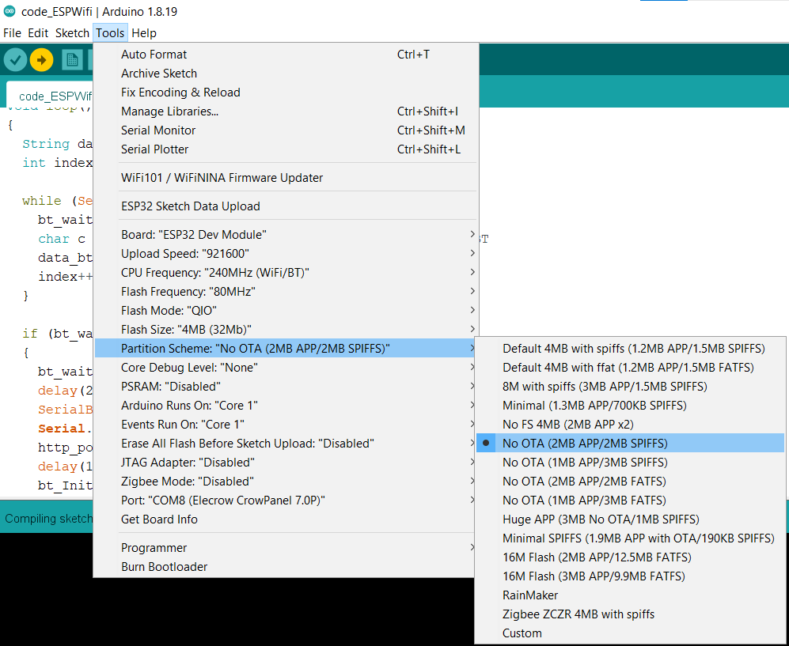

# ESP23_CAM and ESP32_WiFi

## Note
The Bluetooth Class of the ESP32 locks after receiving 512 bytes. 
I fixed it by increasing the RX buffer size in BluetoothSerial.cpp to 2048bytes. If you want to receive large files (like 1MB or more), I don't think you can use this workaround. 
The ESP32 may have enough memory onboard, but it also needs RAM for the stack and heap in addition to whatever you specify for the RX BT buffer in BluetoothSerial.cpp.

Access the BluetoothSerial.cpp file
the path will be as follows:
`C:\Users\name\AppData\Local\Arduino15\packages\esp32\hardware\esp32\3.0.2\libraries\BluetoothSerial\src`

default
> #define RX_QUEUE_SIZE         512

change to
> #define RX_QUEUE_SIZE         4096

## Select configuration for esp32-wifi
